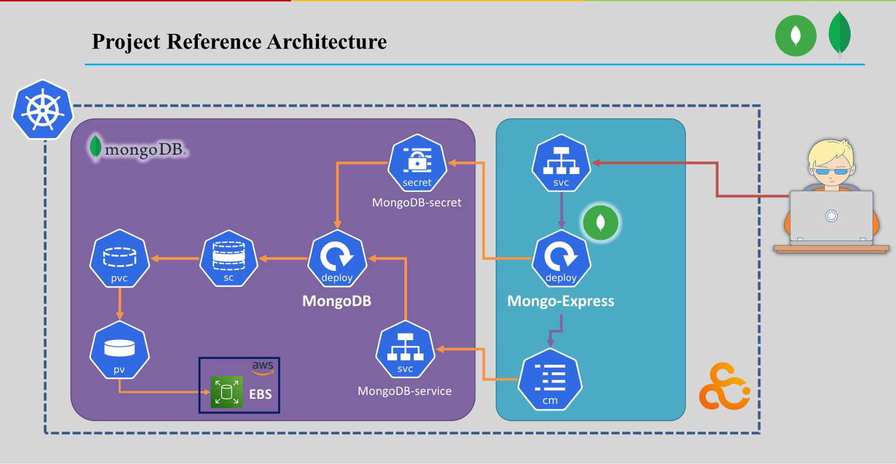
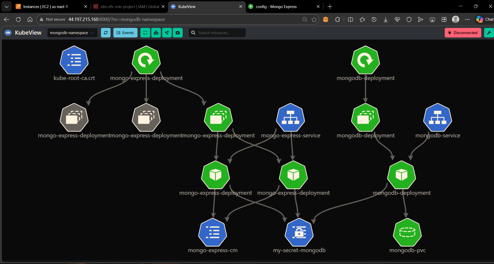
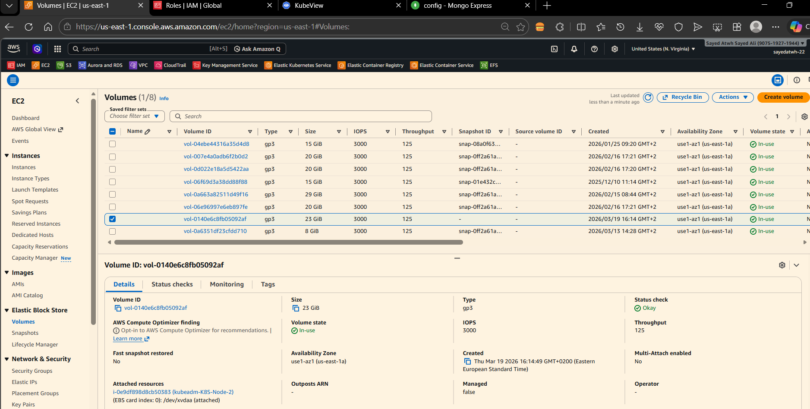
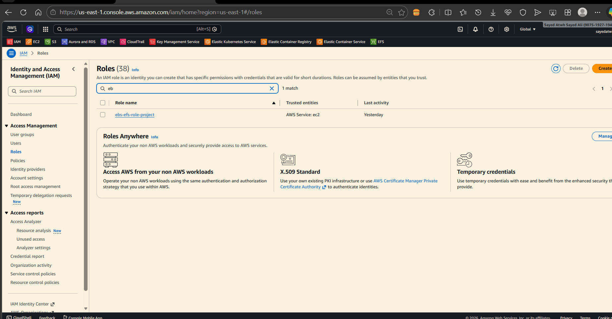
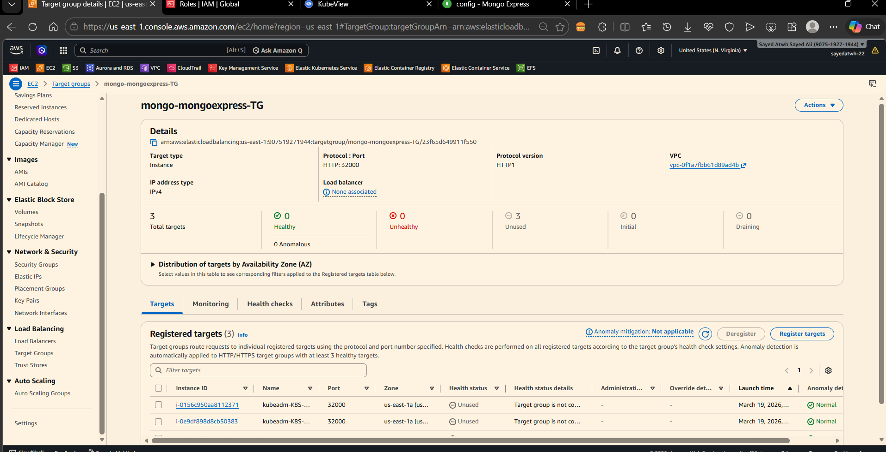
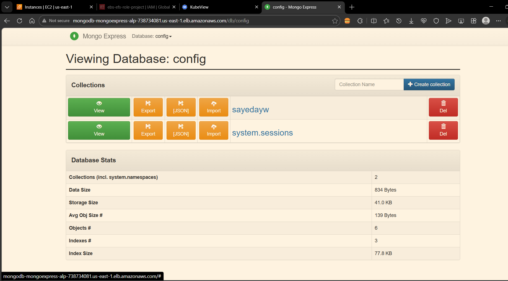
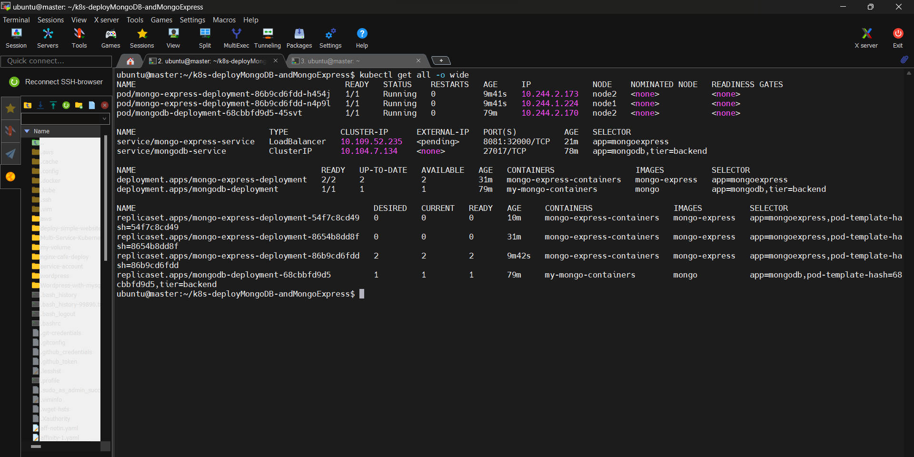
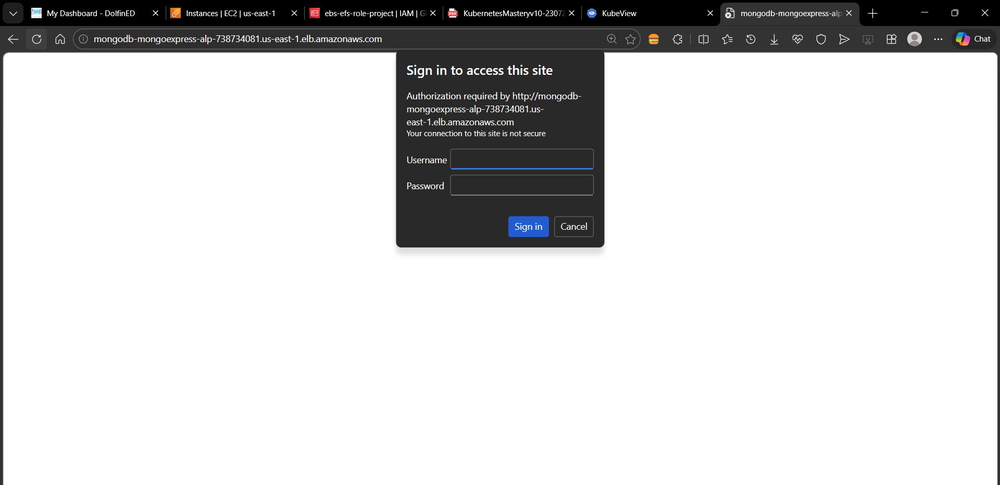

<div align="center">
  
  
  
  
</div>

<h1 align="center">🚀 Kubernetes Deployment: MongoDB & Mongo Express on AWS</h1>

<p align="center">
  <b>A robust, production-ready Kubernetes deployment for MongoDB and its web-based management tool, Mongo Express, on AWS EKS.</b>
</p>

---

## 🏗️ Architecture Overview

The deployment consists of a multi-tier architecture where **MongoDB** acts as the backend database and **Mongo Express** provides a user-friendly frontend interface. 


*Complete system architecture showing all K8s resources and integrations.*


*Visual representation of the K8s deployed resources and their traffic flow.*

---

## ✨ Features

- 💾 **Stateful Data Persistence**: Data survives pod restarts using AWS **Elastic Block Store (EBS)** via `StorageClass` and `PVC`.
- ⚖️ **High Availability**: Mongo Express is horizontally scaled and load-balanced natively on AWS using **Application Load Balancers (ALB)**.
- 🔐 **Robust Security**: Passwords and sensitive data are safely stored in **Kubernetes Secrets** and **ConfigMaps**.
- ☁️ **AWS Native**: Seamless integration with AWS EKS, EBS, and IAM Roles.

---

## 🗂️ Project Structure

```text
📁 K8S-Deploy MongoDB Database and Mongo Express
├── 📜 mongodb-Namspaces.yaml          # Defines the isolated environment
├── 📜 momgoDB-secret.yaml             # Encrypted root credentials 
├── 📜 mongoExpress-Configmap.yaml     # Database connection URLs
├── 📜 mongoDB-SC.yaml                 # AWS EBS StorageClass
├── 📜 mongoDB-PVC.YAML                # Persistent Volume Claim for Mongo
├── 📜 mongoDB-deployment.yaml         # MongoDB Pods definitions
├── 📜 mongoDB-Service.yaml            # Internal ClusterIP for routing
├── 📜 mongo-Express-deployment.yaml   # Frontend Web UI Pods
├── 📜 mongo-Express-Service.yaml      # AWS LoadBalancer for external access
└── 📁 screenshot                      # Architecture & Execution snaps
```

---

## 🛠️ Infrastructure Components

### 1. 📂 Storage & Persistence
Dynamically provisions AWS EBS volumes for MongoDB to ensure no data loss ever occurs.


*AWS EBS volume dynamically provisioned to our cluster.*

### 2. 🔐 Security & IAM Roles
Appropriate IAM roles assigned to the cluster to allow interaction with EBS arrays and AWS load balancers securely.


*AWS EC2 IAM Roles for worker nodes.*

### 3. 🌐 Frontend: Mongo Express & AWS ALB
Deployed with high availability, traffic is routed smoothly into the specific Pods using AWS Native Target Groups.


*AWS Target Groups routing traffic to our Mongo Express nodes.*


*The sleek Mongo Express inner dashboard for database management.*

---

## 🚀 Deployment Guide

### Prerequisites
- Active **AWS EKS** Cluster.
- `kubectl` configured to communicate with your cluster.
- **AWS EBS CSI Driver** installed in the cluster.

### Step-by-Step Execution

1. **Create the Namespace:**
   ```bash
   kubectl apply -f mongodb-Namspaces.yaml
   ```

2. **Setup Storage (SC & PVC):**
   ```bash
   kubectl apply -f mongoDB-SC.yaml
   kubectl apply -f mongoDB-PVC.YAML
   ```

3. **Configure Secrets & ConfigMaps:**
   ```bash
   kubectl apply -f momgoDB-secret.yaml
   kubectl apply -f mongoExpress-Configmap.yaml
   ```

4. **Deploy MongoDB Backend:**
   ```bash
   kubectl apply -f mongoDB-deployment.yaml
   kubectl apply -f mongoDB-Service.yaml
   ```

5. **Deploy Mongo Express Frontend:**
   ```bash
   kubectl apply -f mongo-Express-deployment.yaml
   kubectl apply -f mongo-Express-Service.yaml
   ```

---

## 🏁 Verification

Check if your resources are spinning up correctly:

```bash
kubectl get all -n mongodb-namespace
```


*Verifying running pods, deployments, and services in our namespace.*

### Accessing the Interface

1. Extract the LoadBalancer external IP/DNS:
   ```bash
   kubectl get svc -n mongodb-namespace
   ```
2. Navigate to the extracted URL in your browser on port `8081`.
3. Login using the Basic Auth credentials provided in your Secrets.


*Secure login interface for Mongo Express.*

---

<div align="center">
  <b>Developed by Sayed Atwah</b> <br>
  <a href="https://github.com/SayedAtwh">GitHub Profile</a>
</div>